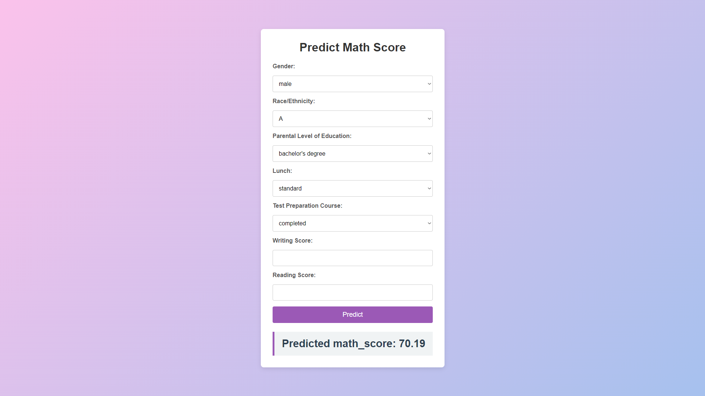

# Predict Math Score 🚀

A production-ready machine learning pipeline that ingests, transforms, and trains a model on student performance data. This project also includes a Flask web application to serve predictions via a user-friendly interface.

## Overview 📊

This project demonstrates a complete end-to-end machine learning workflow:

- **Data Ingestion 📥:**  
  Reads raw student performance data, performs train-test splitting, and saves the results.

- **Data Transformation 🔄:**  
  Applies preprocessing using pipelines for both numerical and categorical features.

- **Model Training & Evaluation 🏆:**  
  Trains multiple regression models with hyperparameter tuning. The best model is selected based on the R² score.

- **Web Application 🌐:**  
  A Flask-based web app that accepts user input via a form and returns predictions.

- **Command-Line Scripts 💻:**  
  Separate scripts to run training (`train_pipeline.py`) and prediction (`predict_pipeline.py`) from the terminal.

> **Best Model Achieved:**  
> **LinearRegression** with an R² score of **0.8795**

---

## Key Features ✨

- **Modular Design:**  
  Each component (ingestion, transformation, training, and prediction) is encapsulated in its own module for easy maintenance and scalability.

- **Robust Error Handling:**  
  Custom exception handling ensures detailed error logging for debugging and maintenance.

- **State-of-the-Art Pipelines:**  
  Utilizes scikit-learn pipelines and column transformers for efficient data processing.

- **Hyperparameter Tuning:**  
  Leverages GridSearchCV to optimize model performance.

- **User-Friendly Web Interface:**  
  A clean, modern Flask application that allows users to input data and receive real-time predictions.

- **Command-Line Accessibility:**  
  Easy-to-use CLI scripts for both training and prediction.

---

## Architecture Overview 🏗️

- **Data Flow:**  
  Raw data is ingested → Preprocessed → Models are trained & tuned → Best model is selected and saved → Predictions are served via CLI and the Flask web app.

- **Technology Stack:**  
  - **Python** for core programming  
  - **scikit-learn** for machine learning pipelines  
  - **Flask** for web application development  
  - **GridSearchCV** for hyperparameter tuning  
  - **dill** for object persistence

---

## App Screenshot 🗺️

---
